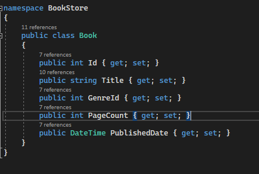

# BookStoreApi
# LCBootCamp 1. Hafta Ödevim

Bir internet sitesindeki kitap kategorisini örnek alarak bir web api oluşturdum.

## Paketler 
    dotnet add package Microsoft.EntityFrameworkCore.InMemory -v 5.0.6
    dotnet add package Microsoft.EntityFrameworkCore -v 5.0.6
    
# Endpoints
|HTTP|URL|METOT|
|---|---|---|
|GET| https://localhost:44348/api/v1/Books |GetBooks|
|GET| https://localhost:44348/api/v1/Books/{id} |GetById|
|GET| https://localhost:44348/api/v1/Books/Search |Search|
|PUT| https://localhost:44348/api/v1/Books?id={id} |UpdateBook|
|POST| https://localhost:44348/api/v1/Books |AddBook|
|DELETE| https://localhost:44348/api/v1/Books?id={id} |DeleteBook|

# API 

## GetBooks

## GetById

## Search

## UpdateBook

 
## AddBook

## DeleteBook

## Entities

